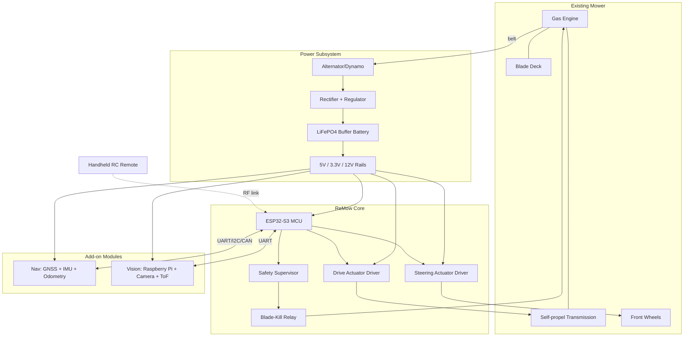
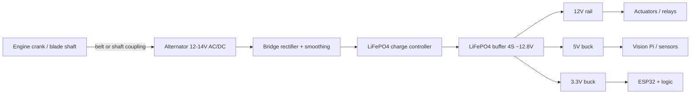
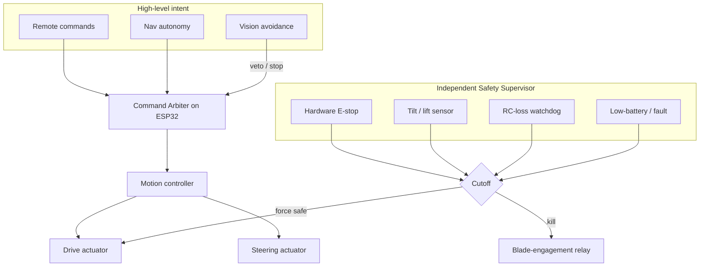
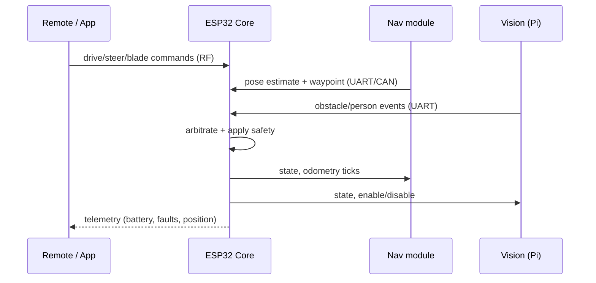

# System Architecture

ReMow is organized into four subsystems: **power**, **control**, **actuation**, and **perception/navigation**. The ReMow Core board ties them together and enforces safety independently of the higher-level autonomy.

## High-level block diagram

## Power flow

The buffer battery decouples electrical load from engine RPM so actuators and logic get stable power even at idle or during transient blade loading. See [electrical.md](electrical.md) for the power budget.

## Control loop and safety hierarchy

Safety is enforced by a **supervisor** path that can cut the blade and stop drive **independently** of the ESP32 application logic and any autonomy module. Higher tiers can only *request* motion; they can never override a safety cutoff.

**Priority order (highest first):** hardware e-stop -> tilt/lift kill -> RC-loss failsafe -> Vision safety stop -> Nav autonomy -> remote commands.

## Data flow between modules

## Module responsibilities

- **ESP32-S3 Core:** real-time motor/steering control, RC link, command arbitration, safety supervision, telemetry. Deterministic, always-on.
- **Nav module:** sensor fusion (GNSS + IMU + wheel odometry) -> pose; path planning and coverage; geofence. Sends waypoints, never touches actuators directly.
- **Vision module (Pi):** perception only. Emits obstacle/person events that the Core treats as high-priority vetoes. Never commands motion directly.
