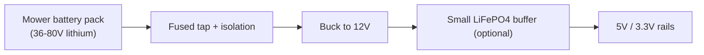
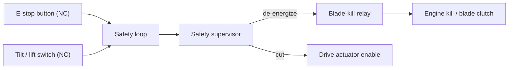

# Electrical Design

The electrical system supplies power, buffers it, and distributes regulated rails to the Core, actuators, and add-on modules. It also implements the hardware safety cutoffs. ReMow supports **two interchangeable power modules** that share the same output connector to the Core, chosen by target mower (see [mower-compatibility.md](mower-compatibility.md) and [install-kit.md](install-kit.md)):

- **Battery/controller tap (flagship, battery-electric mowers)** - reuse the mower's existing lithium pack. Simplest, no generation hardware.
- **Alternator subsystem (gas mowers)** - generate power from the running engine.

The rest of the board (rails, safety, connectors) is identical regardless of power module.

## Power option A: battery/controller tap (battery-electric mowers)

Battery-electric self-propelled mowers (EGO 56V, Ryobi 40V, Greenworks 60/80V) already carry a large lithium pack, so ReMow does not need an alternator. The tap module draws a modest amount from the existing pack and regulates it down to the ReMow rails.

Design notes:

- **Tap point:** the pack output / drive-controller input, behind a dedicated fuse and reverse-polarity protection. Do not interfere with the mower's own BMS or safety cutoffs.
- **Wide-input buck:** the pack voltage varies by brand (nominal ~36-80V), so use a wide-input DC-DC to produce a stable 12V, then the standard 5V/3.3V bucks.
- **Budget impact:** ReMow's electronics load (tens of watts) is small next to a mower drive/blade motor; account for the reduced runtime on the mower's own battery, or add a separate small pack for ReMow if you want to preserve mow time.
- **Optional small buffer:** a tiny LiFePO4 buffer smooths transients and enables a "limp to safe stop" if the tap is interrupted.
- **No load-dump concerns** like a spinning alternator, but still fuse and isolate properly.

## Power option B: the alternator subsystem (gas mowers)

The engine already produces mechanical power; ReMow taps a small fraction of it to make electricity.

```mermaid
flowchart LR
  Shaft["Engine crank or blade shaft"] -->|"belt / pulley"| Alt["Alternator or dynamo<br/>(12-14V, 10-30A class)"]
  Alt --> Bridge["Bridge rectifier<br/>(if AC output)"]
  Bridge --> TVS["TVS / load-dump clamp"]
  TVS --> Charger["LiFePO4 charge controller"]
  Charger --> Batt["LiFePO4 4S ~12.8V buffer"]
  Batt --> Fuse["Main fuse + reverse-polarity FET"]
  Fuse --> Rails["DC-DC regulators"]
```

Design notes:

- **Source options:** (a) a small automotive/motorcycle **alternator** belted to the crankshaft, (b) a **PMA/dynamo** (permanent-magnet alternator) which is simpler and self-exciting, or (c) a **BLDC motor used as a generator**. A PMA + bridge rectifier is the simplest for a first prototype.
- **Load dump / transients:** engine-driven generators produce spikes; a TVS clamp and adequate bulk capacitance protect downstream electronics.
- **Buffer battery:** a 4S LiFePO4 pack (~12.8V nominal) decouples electrical load from engine RPM and lets the system ride through idle and blade-load transients. It also allows a brief "limp to safe stop" if generation is lost.
- **Charge control:** a LiFePO4-appropriate charge controller/BMS prevents overcharge and provides low-voltage cutoff.

## Voltage rails

| Rail | Source | Loads |
|------|--------|-------|
| 12V | Buffer battery (direct, fused) | Actuators, relays, alternator field (if used) |
| 5V | Buck from 12V | Raspberry Pi (Vision), sensors, RC receiver |
| 3.3V | Buck from 5V/12V | ESP32-S3, logic, IMU, GNSS logic |

Each rail is independently fused; the actuator (12V) rail is isolated so a stalled actuator cannot brown out the logic.

## Power budget (indicative)

| Load | Tier | Typical | Peak |
|------|------|--------:|-----:|
| ESP32-S3 + logic | Core | 0.5 W | 1.5 W |
| RC receiver | Core | 0.3 W | 0.5 W |
| Steering actuator | Core | 6 W | 30 W (stall) |
| Drive-engagement actuator | Core | 6 W | 30 W (stall) |
| Blade-kill relay coil | Core | 1 W | 2 W |
| GNSS + IMU + encoders | Nav | 1 W | 2 W |
| Raspberry Pi 5 | Vision | 6 W | 12 W |
| Camera + ToF/ultrasonic | Vision | 2 W | 4 W |
| **Approx totals** | Core | **~14 W** | **~64 W** |
| | + Nav | **~15 W** | **~66 W** |
| | + Vision | **~23 W** | **~82 W** |

An alternator/PMA in the **150-250 W** class provides comfortable headroom for all tiers, including transient actuator stalls, while charging the buffer. **Option C skid-steer** (dual wheel motors) can add hundreds of watts and likely needs a larger alternator or a bigger battery treated as the primary energy source with the alternator as a range-extending charger - documented in [mechanical.md](mechanical.md).

## ReMow Core connector map

The Core board exposes the following connectors (see the KiCad schematic in [../hardware/kicad/](../hardware/kicad/)):

- **J1 - Power In:** buffered 12V + GND from battery/charger.
- **J2 - Drive actuator:** H-bridge output (2-wire) + limit/feedback.
- **J3 - Steering actuator:** H-bridge output (2-wire) + position feedback (pot/encoder).
- **J4 - Blade-kill relay:** dry-contact drive to the engine kill / blade-clutch circuit.
- **J5 - E-stop loop:** normally-closed safety loop input.
- **J6 - Tilt/lift:** tilt switch + accelerometer (I2C).
- **J7 - RC receiver:** UART/PPM/SBUS + 5V.
- **J8 - Expansion (add-ons):** 5V, 3.3V, GND, shared UART, I2C, CAN, 2x spare GPIO, module-ID line.

## Expansion header (J8) pinout (indicative)

| Pin | Signal | Pin | Signal |
|----:|--------|----:|--------|
| 1 | +12V | 2 | +12V |
| 3 | +5V | 4 | +5V |
| 5 | +3.3V | 6 | GND |
| 7 | UART_TX | 8 | UART_RX |
| 9 | I2C_SDA | 10 | I2C_SCL |
| 11 | CAN_H | 12 | CAN_L |
| 13 | GPIO_A | 14 | GPIO_B |
| 15 | MODULE_ID (1-Wire/I2C EEPROM) | 16 | GND |

## Safety wiring

- The **safety loop is normally-closed**: any break (button pressed, connector unplugged, tilt) de-energizes the blade-kill relay and drops drive enable. This is a **fail-safe** design - loss of the loop stops the machine.
- The blade-kill relay is wired so that **de-energized = safe** (engine kill grounded / blade clutch released).
- The supervisor path does not depend on ESP32 firmware to execute the cutoff; firmware only reports and requests.

> [!WARNING]
> All safety wiring must be validated on the bench and then on a wheels-off, blade-removed test rig before any powered field test. Verify that every listed fault (e-stop, unplug, tilt, RC loss, power loss) actually stops the blade and drive.
