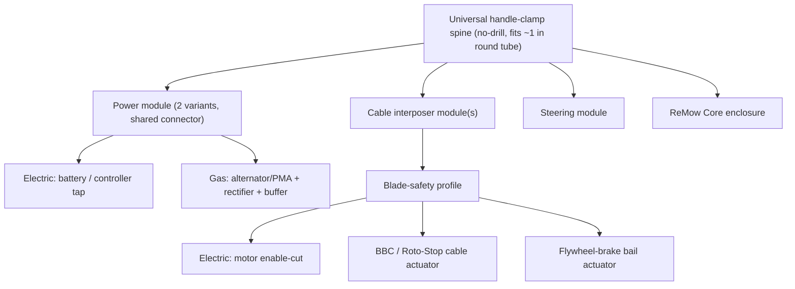
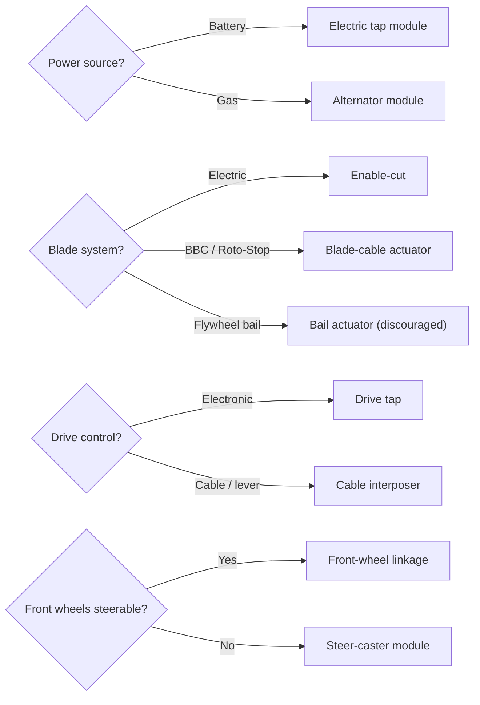

# ReMow Fit Kit - Universal Install

The **ReMow Fit Kit** is the product that makes ReMow easy to add to a mower you already own. Design goals:

- **Universal / model-agnostic** - fits the broad range of self-propelled walk-behinds instead of one model.
- **Reversible, no-weld, no-drill** - clamps and cable interposers only; the mower can be returned to stock.
- **Hand-tools only** - target install under ~1-2 hours.
- **Configurable** - the [compatibility rubric](mower-compatibility.md) selects exactly which adapters ship for your mower.

> [!WARNING]
> ReMow controls a machine with an exposed rotating blade. The install is not complete until the **bench safety test** passes (see step 8). Never skip it.

## Module overview

### 1. Universal mounting spine
- Two to four **adjustable no-drill clamps** that grip standard handle tubes (fits common ~1 in / ~7/8 in round steel tube; shims for oval/other).
- A rigid cross-member/plate that carries the Core enclosure, cable interposers, and power module.
- Vibration-isolating grommets (important on gas engines).
- Works whether the handle is retained, folded, or cut to a stub - see [mechanical.md](mechanical.md).

### 2. Cable interposer module(s)
The heart of the "universal" claim: a compact servo or linear actuator that **pulls an existing Bowden control cable or lever** using universal cable clamps and an adjustable travel stop. One design handles many mowers:

| Mower control | What the interposer actuates |
|---------------|------------------------------|
| Toro Personal Pace | The reactive drive bail/handle input |
| Honda Select Drive | The speed dial linkage / drive cable |
| Honda Cruise Control (hydrostatic) | The speed-set lever |
| Troy-Bilt InStep / Cub Cadet MySpeed | The variable-speed drive cable |
| Any drive bail | The engage/release cable |

- **Travel calibration** in firmware maps actuator position to "released -> full speed", so the same hardware fits different cable throws.
- **Spring return** so a power loss releases drive (fail-safe).
- Battery-electric mowers usually **skip the drive interposer** in favor of the electronic drive tap (below), which is cleaner.

### 3. Power module (two variants, one connector)
Both variants terminate in the same keyed connector to the Core, so the rest of the kit is identical.

- **Electric tap module (flagship):** connects to the mower's existing battery/controller power and steps it down to the ReMow rails. No alternator, minimal fabrication. Includes proper fusing and isolation.
- **Gas alternator module (second track):** belt/PMA alternator + rectifier + LiFePO4 buffer, per [electrical.md](electrical.md). Ships when the target is a gas mower.

### 4. Blade-safety profile (choose one)
Selected by the configurator based on the mower's blade system:

- **Electric enable-cut** (battery mowers): the Core opens the blade-motor enable/contactor for an instant, independent stop. Safest.
- **BBC / Roto-Stop cable actuator** (Toro Blade Stop, Honda Roto-Stop): interposer releases the blade-control cable to stop the blade while the engine runs.
- **Flywheel-brake bail actuator** (basic gas mowers): interposer releases the bail.
  > [!WARNING]
  > On flywheel-brake mowers, stopping the blade also **kills the engine** (and thus drive/charging). This profile is supported but strongly discouraged for autonomy; prefer a BBC/Roto-Stop or electric mower.

### 5. Steering module
Bolt-on/clamp-on implementation of the steering options in [mechanical.md](mechanical.md):

- **Clamp-on front-wheel steering linkage** (universal knuckle/tie-rod kit) - baseline.
- **Add-on steer-caster module** for mowers where the front wheels cannot be made steerable.
- Optional **wheel-odometry clip-on encoders** for the Nav tier.

## Configurator: rubric -> kit contents

The buyer answers a few questions (mirrored from the [rubric](mower-compatibility.md)); the answers select the SKUs shipped:

Every configuration ships the **same** Core, mounting spine, safety kit (e-stop, tilt/lift, relay/contactor), and remote - only the power module, blade profile, drive adapter, and steering adapter vary.

## Model-agnostic install flow

Target: hand tools, reversible, ~1-2 hours. Detailed, model-specific torque specs are out of scope by design; the kit adapts to the mower.

1. **Prep & safety:** disconnect the spark plug boot (gas) or remove the battery (electric). Confirm the mower is off and cannot start.
2. **Handle setup:** fold or remove the upper handle, or leave it and mount around it (your choice - see [mechanical.md](mechanical.md)).
3. **Mount the spine:** clamp the mounting spine to the handle tube; level it and seat the vibration grommets. No drilling.
4. **Power module:** fit the electric tap (to battery/controller) or the alternator module (belt + buffer). Route power to the Core connector; do not energize yet.
5. **Drive control:** attach the electronic drive tap (electric) or clamp the cable interposer onto the drive cable/lever (gas). Leave slack for calibration.
6. **Blade-safety profile:** install the selected blade interface (enable-cut wiring, or blade-cable/bail actuator). Wire the blade-kill relay/contactor into the safety loop.
7. **Steering & safety inputs:** install the steering linkage/caster; mount the e-stop button, tilt/lift sensor, and RC receiver; connect the normally-closed safety loop.
8. **Bench safety test (mandatory, wheels-off + blade removed):**
   - Verify every fault - e-stop pressed, connector unplugged, tilt, RC loss, power loss - **stops drive and blade**.
   - Calibrate cable-interposer travel (released -> full speed) and steering end stops in firmware.
   - Only after all fault cases pass: reinstall blade/wheels and proceed to a controlled, fenced field test.

See [roadmap.md](roadmap.md) for how install validation fits the overall phase plan, and [bom.md](bom.md) for kit components.
