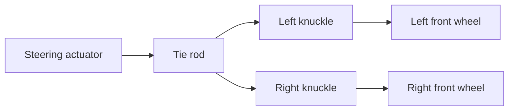
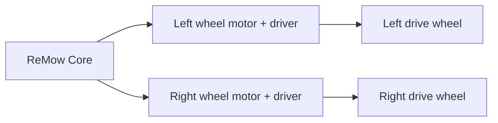

# Mechanical Design

This covers the physical conversion of a walk-behind self-propelled mower: removing/repurposing the handle, mounting the ReMow hardware, and driving the two things the robot must physically control - **propulsion** (via the existing self-propel drive) and **steering**.

> Compatibility note: self-propelled walk-behind mowers vary widely. Most are **single-axle drive** (either front-wheel drive, FWD, or rear-wheel drive, RWD) with a bail/lever on the handle that engages a belt-driven transmission. ReMow's baseline design targets this common configuration. Per-model adapter plates and linkages are expected.

## 1. Handle removal / conversion

The handle serves three functions we must replace: it holds the **operator-presence bail** (dead-man's control), it routes the **self-propel drive cable**, and it carries the **blade-brake/clutch (BBC) or engine-kill** control.

Options:

- **Handle removal (preferred for clean builds).** Remove the upper handle entirely. Terminate the drive cable and blade-control cable at the ReMow actuator bracket that mounts where the handle base attached. The operator-presence bail is replaced by the ReMow safety supervisor (see below) - this is a deliberate, safety-critical substitution.
- **Handle stub retention.** Cut the handle down to a short stub and mount the electronics enclosure and actuators to it. Easier fabrication, keeps factory cable routing, but bulkier.
- **Foldable handle for manual override.** Retain a foldable handle so the mower can still be pushed manually with ReMow disengaged. Recommended for early prototypes.

> [!IMPORTANT]
> The factory operator-presence system is a legally-required safety device. Replacing it means **ReMow must reproduce equivalent or better safe-stop behavior**: loss of control link, tilt, or e-stop must stop the blade and drive at least as fast as releasing the bail would. See [Safety interlocks](#safety-interlocks).

## 2. Mounting frame

A welded or bolted **subframe** mounts to existing hard points (handle mounts, deck bolts, engine shroud bolts) and carries:

- The ReMow Core enclosure (IP-rated, vibration-isolated).
- The alternator and its belt tensioner/bracket.
- The drive-engagement actuator and the steering actuator.
- The buffer battery (low, centered for stability).
- Add-on module bays (Nav antenna mast, Vision camera/sensor pod).

Design guidance:

- Vibration isolation (rubber mounts/grommets) on all electronics - a mower engine is a harsh vibration environment.
- Keep the center of gravity low and centered; the mower already has a tilt kill, but stability reduces nuisance stops.
- All electronics enclosures IP54 minimum (grass, dust, moisture, wash-down).
- Heat: keep electronics away from the engine exhaust/muffler; add a heat shield if needed.

## 3. Propulsion: driving the existing self-propel

Rather than replacing the transmission, ReMow **actuates the existing drive-engagement control** (the bail/lever that tensions the drive belt). This preserves the factory drivetrain and warranty of the mechanical parts.

- **Single-speed mowers:** the actuator engages/releases drive - speed is effectively on/off, so ground speed is modulated by **PWM engagement** (rapid engage/disengage) or duty-cycled bail position where the transmission tolerates slip.
- **Variable-speed mowers (with a speed lever/trigger):** add a second actuator (or a geared servo) on the variable-speed control for true speed control.
- Use a linear actuator or a high-torque metal-gear servo sized to the measured cable pull force (typically a few kg-f). Include a **spring return** so a power loss releases drive (fail-safe stop).

## 4. Steering (the hardest problem) - three documented options

A single-axle-drive walk-behind has **no factory steering**; the operator steers by hand. ReMow must add a steering mechanism. Three approaches, from least to most invasive:

### Option A - Front-wheel steering linkage (recommended baseline)
Add a steering knuckle/tie-rod linkage to the **non-driven** wheels (front wheels on a RWD mower) driven by a linear actuator or high-torque servo.

- Pros: intuitive Ackermann-like steering, keeps single-axle drive, modest power draw.
- Cons: requires fabricating knuckles/linkage per wheel design; turning radius limited; not "turn in place".
- Best for: FWD/RWD mowers where the front (or rear) axle can be made steerable.

### Option B - Differential brake-steering
Keep the driven axle powered straight, and **brake one driven wheel** to induce a turn (like a zero-turn's inside wheel). Implemented by adding an independent brake (band/disc) on each driven wheel, actuated by the Core.

- Pros: no steering knuckles; tighter turns than Option A; reuses the single drive.
- Cons: requires a differential or independently-freewheeling driven wheels; braking wastes energy and scuffs turf; harder to control precisely.
- Best for: mowers whose driven wheels can rotate independently (open differential or dog-clutch axle).

### Option C - Full skid-steer conversion (most capable, most work)
Remove the factory single-axle drive and fit **two independent electric wheel motors** (hub or geared), giving true differential/skid steering and turn-in-place.

- Pros: best maneuverability, precise closed-loop control with encoders, ideal for autonomy.
- Cons: largest conversion, adds significant electrical load (may exceed a small alternator's output - see [electrical.md](electrical.md)), abandons the factory drivetrain, higher cost.
- Best for: buyers wanting the most capable autonomous behavior and willing to do heavy conversion.

### Recommendation
Ship **Option A** as the baseline kit (broadest compatibility, lowest power), document **Option B** as a per-model alternative, and treat **Option C** as an advanced/experimental path for the Vision tier where precise autonomy matters most.

## Safety interlocks

- **Hardware e-stop:** a normally-closed loop that, when broken, cuts the blade-engagement relay and releases drive - independent of firmware.
- **Tilt/lift kill:** accelerometer + tilt switch; if the mower tips past a threshold or is lifted, kill blade and drive.
- **Spring-return actuators:** loss of power releases both drive and (where applicable) engages the blade brake.
- **RC-loss failsafe:** the Core stops if the control link drops for more than a set timeout.

See [architecture.md](architecture.md) for the safety priority hierarchy and [electrical.md](electrical.md) for wiring.
