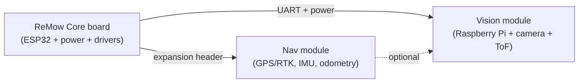

# Product Tiers & Upgrade Path

ReMow is sold and built as a base kit plus optional add-on modules. The design goal is that **no customer ever has to throw away hardware to upgrade**: the ReMow Core controller board is common to every tier and exposes a standard expansion connector that the higher tiers plug into.

## Design principle: common core, modular add-ons

- The **expansion connector** carries regulated 5V/3.3V power, a shared UART, I2C, and CAN, plus a few spare GPIO. This is the single interface every add-on uses.
- Add-ons are enclosed, weatherized modules with a keyed connector. Installing an upgrade is "unplug the cap, plug in the module".
- Firmware auto-detects attached modules over I2C ID EEPROM so the same Core firmware image works at every tier.

## Tier 1 - ReMow Core (RC)

The base kit. Turns the mower into a remote-controlled robot with a full safety stack.

**Included**
- ReMow Core controller board (ESP32-S3).
- Engine-driven alternator/dynamo + rectifier/regulator + LiFePO4 buffer battery.
- Drive actuator that engages/releases the existing self-propel drive control.
- Steering actuator (front-wheel linkage kit).
- Handheld RC remote (ESP-NOW or ExpressLRS).
- Safety stack: hardware e-stop, blade-engagement kill relay, tilt/lift kill switch, RC-loss failsafe.
- Mounting frame + handle-conversion hardware.

**Capabilities**
- Manual remote driving (forward/steer, speed via drive-engagement modulation).
- Blade engage/disengage from the remote.
- Automatic safe-stop on tilt, lift, RC loss, or low battery.

**Not included:** autonomy, GPS, mapping, cameras.

**Indicative BOM cost:** ~$150-200. See [bom.md](bom.md).

## Tier 2 - ReMow Nav (add-on)

Adds position awareness and autonomous mowing along user-defined routes.

**Included**
- Nav module: GNSS receiver (RTK-capable), 9-DoF IMU, wheel encoder inputs.
- Optional RTK base station or NTRIP support for centimeter accuracy.
- Phone/web app for drawing the mowing area, no-go zones, and route patterns.

**Capabilities**
- Record/replay routes and generate coverage patterns (boustrophedon/spiral).
- Autonomous mowing within a mapped boundary with geofence enforcement.
- Return-to-dock / return-to-start.

**Requires:** Tier 1 Core. **Indicative BOM cost:** ~$150.

## Tier 3 - ReMow Vision (add-on)

Adds perception for obstacle avoidance and safety.

**Included**
- Raspberry Pi companion (Pi 5 or Pi Zero 2 W depending on model line).
- Camera + ToF/ultrasonic sensor array.
- Perception firmware for object detection and classification.

**Capabilities**
- Detect and avoid obstacles (toys, hoses, furniture).
- Person/pet safety stop that overrides autonomy and disengages the blade.
- Richer app telemetry (live camera, detections).

**Requires:** Tier 1 Core; strongly recommended alongside Tier 2 Nav. **Indicative BOM cost:** ~$200+.

## Feature matrix

| Capability | Core | Nav | Vision |
|-----------|:----:|:---:|:------:|
| Remote driving | Yes | Yes | Yes |
| Blade engage/kill | Yes | Yes | Yes |
| E-stop / tilt / lift / RC-loss failsafe | Yes | Yes | Yes |
| Position (GPS/IMU/odometry) | - | Yes | Yes |
| Mapped routes / autonomy | - | Yes | Yes |
| Geofence | - | Yes | Yes |
| Object detection / avoidance | - | - | Yes |
| Person/pet safety stop | - | - | Yes |

## How pricing shapes the upgrade path

- The **Core** carries the expensive, universal hardware (power generation, drivers, safety) so upgrades stay cheap and additive.
- Because Nav and Vision are separate SKUs, a buyer can enter at the lowest price point and spread cost over time.
- The Raspberry Pi lives **only** in the Vision add-on, keeping the Core cost low for buyers who never want cameras.
- A "ReMow Autonomy Bundle" (Core + Nav + Vision) can be offered at a discount versus buying tiers separately.
