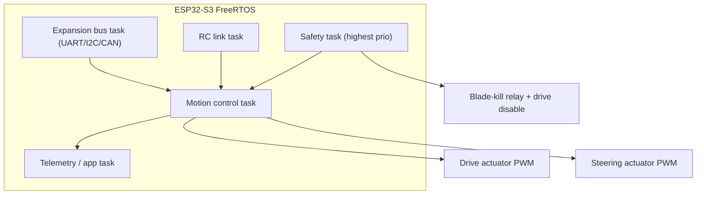
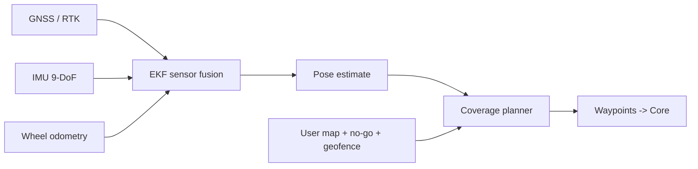
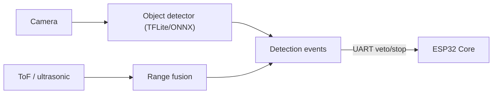

# Software Design

Software spans three places: the **ESP32-S3 Core firmware** (real-time, safety-critical), the **Nav module** (localization + planning), and the **Vision module** on a Raspberry Pi (perception). A companion **remote/app** provides control and configuration.

## Firmware architecture (ESP32-S3 Core)

Runs on ESP-IDF/FreeRTOS. Tasks are prioritized so safety and control always preempt telemetry and comms.

Responsibilities:

- **Safety task:** polls e-stop loop, tilt/lift, RC-link watchdog, battery/faults; owns the blade-kill relay and drive-enable. Cannot be overridden by any other task or module.
- **Motion control task:** closed-loop steering (position feedback) and drive engagement/speed modulation; arbitrates command sources by priority.
- **RC link task:** decodes the remote link (ESP-NOW or SBUS/CRSF from an ELRS receiver); enforces failsafe on loss.
- **Expansion bus task:** talks to Nav/Vision modules; detects module presence via the J8 module-ID EEPROM; exposes a simple message protocol.
- **Telemetry/app task:** Wi-Fi/BLE endpoint for the app; publishes battery, faults, mode, position; lowest priority.

### Command arbitration

Priority (highest wins / can veto):

1. Hardware safety cutoff (not software - always wins).
2. Vision safety stop (person/pet/obstacle) -> forces stop.
3. RC-loss failsafe -> forces safe stop.
4. Manual remote commands.
5. Nav autonomy waypoints.

Manual remote input always overrides Nav autonomy (operator takeover), but never overrides a safety stop.

## Remote control link & protocol

- **Default:** ExpressLRS (ELRS) receiver -> CRSF/SBUS into the Core for long range and robust failsafe. Alternative: **ESP-NOW** between two ESP32s for a cheap, low-latency, license-free 2.4 GHz link.
- **Channels:** steer, drive/speed, blade engage (guarded), mode (manual/auto), e-stop request.
- **Failsafe:** receiver failsafe + Core watchdog. Link loss > timeout (e.g. 500 ms) -> release drive, hold safe; blade behavior configurable but defaults to disengage.
- **Handheld remote:** an ESP32-based transmitter with sticks + guarded blade switch + physical e-stop, or a standard RC transmitter with an ELRS module.

## App / configuration interface

- **Transport:** BLE for provisioning, Wi-Fi (SoftAP or LAN) for the map/route UI and live telemetry.
- **Features:** draw mow area and no-go zones (Nav), pick coverage pattern, start/stop, live position, battery/fault display, live camera + detections (Vision).
- **Implementation target:** a lightweight web app served by the Nav/Vision module or a companion phone app; the Core exposes a small HTTP/WebSocket + BLE GATT API.

## Nav module software (Tier 2)

- **Localization:** EKF/UKF fusing RTK-GNSS (cm-level when corrections available), IMU, and wheel odometry.
- **Planning:** boustrophedon (back-and-forth) and spiral coverage within the mapped boundary; obstacle inflation from Vision events.
- **Geofence:** hard boundary; crossing triggers a stop request to the Core.
- **Runtime options:** microcontroller-class MCU with an RTOS, or run on the Vision Pi if both add-ons are present (shared compute).

## Vision module software (Tier 3, Raspberry Pi)

- **Perception:** a lightweight detector (e.g. quantized MobileNet-SSD/YOLO-nano class) for person/pet/obstacle classes, accelerated where available.
- **Safety role:** emits high-priority **stop/veto** events to the Core; it never commands motion directly. A detected person/pet forces a stop and blade disengage.
- **Telemetry:** streams annotated frames + detections to the app.
- **OS/stack:** Raspberry Pi OS, Python/C++ inference service, communicates with the Core over UART on the J8 expansion header.

## Firmware repo layout

See [../firmware/](../firmware/). A PlatformIO project targets the ESP32-S3 with placeholder tasks matching the architecture above. Nav and Vision services are separate components to be added as those tiers are developed.

## Testing & safety validation

- Bench test each safety input (e-stop, tilt, RC loss, power loss) with wheels off and blade removed.
- Hardware-in-the-loop: simulate RC and module messages; verify arbitration priority order.
- Field test only after all fault cases reliably stop drive and blade on a test rig.
